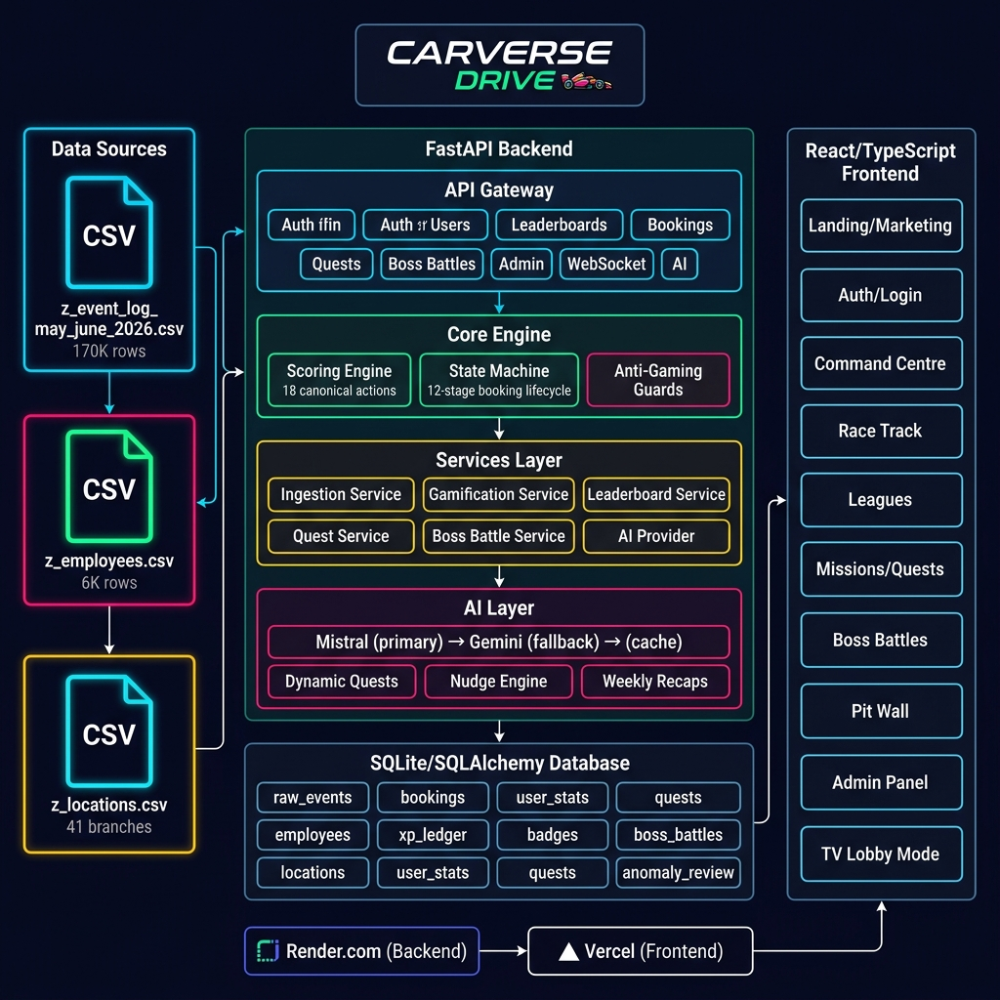
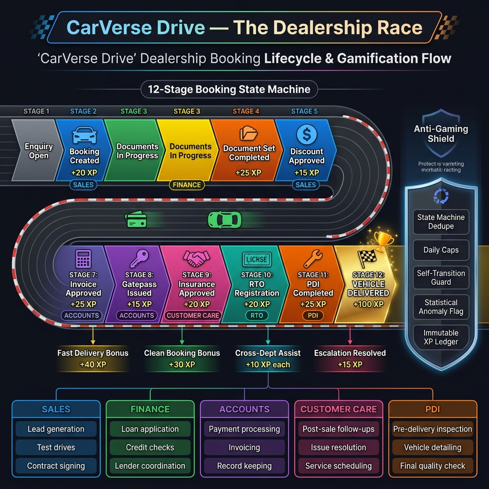

<p align="center">
  
</p>

<p align="center"><sub>Premium motorsport telemetry · Verified performance · Live competition</sub></p>

<p align="center">
  <a href="#-the-problem"><strong>Problem</strong></a> ·
  <a href="#-the-solution"><strong>Solution</strong></a> ·
  <a href="#-feature-set"><strong>Features</strong></a> ·
  <a href="#-architecture"><strong>Architecture</strong></a> ·
  <a href="#-quick-start"><strong>Quick start</strong></a> ·
  <a href="#-repository-guide"><strong>Repository guide</strong></a>
</p>

<p align="center">
  <strong>Real dealership work, transformed into a fair, visible, and motivating race.</strong>
</p>

<p align="center">
  
  
  
  
  
</p>

> **CarVerse Drive** is a full-stack gamification engine for a real multi-branch car dealership group. It makes verified dealership milestones visible as races, XP, missions, boss battles, leagues, rewards, and live celebration—without letting a click fabricate business performance.

<p align="center">
  
</p>

## 🏁 The problem

Large dealership groups run on hundreds of invisible handoffs: enquiry, booking, documentation, finance, invoicing, gatepass, insurance, registration, PDI, dispatch, and delivery. The work is distributed across departments and branches, but recognition often arrives late, focuses only on final sales, and leaves employees with little visibility into the larger outcome.

The hackathon challenge was to turn this operational reality into a game **without compromising fairness or trust**:

- Reward meaningful work across the dealership—not just the final delivery.
- Build healthy competition across employees, departments, and branches.
- Make progress instantly understandable and genuinely motivating.
- Use the supplied operational CSVs as the source of truth.
- Prevent duplicate, out-of-order, self-serving, or fabricated actions from distorting scores.

## 🚀 The solution

CarVerse Drive converts the dealership lifecycle into a **12-stage booking race**. Every organizer-provided event is normalized, audited, and replayed through a deterministic state machine. Only a valid, once-per-booking, role-appropriate milestone can move a car forward and create an append-only XP ledger record.

The result is an enterprise-ready game layer that connects real work to visible momentum:

```text
Verified dealership event
        ↓
State-machine validation + anti-gaming checks
        ↓
Immutable XP ledger + booking race progression
        ↓
Level / badge / quest / boss contribution / league update
        ↓
Realtime celebration, visual feedback, and a clear next move
```

For the hackathon demonstration, a carefully bounded **Demo Workstation** simulates the same validated next milestone that a future DMS/API integration would send. It is disabled in production and cannot bypass department ownership or stage order.

## ✨ Feature set

### A playable dealership game loop

| Capability | What the employee experiences | What keeps it credible |
|---|---|---|
| **Pit Wall / My Next Move** | Role-specific work cards, a daily check-in, near-miss prompts, team rally, and focus-mission selection | Mission focus and rally participation grant no free XP |
| **Booking Race Track** | A car moves through 12 dealership stages; replay pauses at each already-verified handoff | The route is rendered from backend race data only |
| **XP, levels & reputation** | XP counters, level titles, streaks, clean-work reputation, level-up ceremonies | Scores are derived from the ledger and configured rules |
| **Missions** | Choose a focus, complete verified objectives, then claim a reward | Claiming is allowed only after backend-verified completion |
| **Boss Battles / Team Rally** | Departments collectively defeat milestone-linked bosses and claim shared rewards | Contribution comes from real qualifying milestone records |
| **Leagues** | Individual, branch, and department standings across weekly, monthly, and all-time views | Branch comparison uses normalized score, not misleading raw volume |
| **Garage, cosmetics & trophies** | Interactive Three.js driver garage, cosmetic unlocks, realistic trophy moments, badges and reward celebrations | Cosmetics are visual rewards; they never affect performance or rank |
| **Shift Replay & Lobby Mode** | Judge-friendly playback of a real lifecycle and a rotating TV-style showroom display | Replays are read-only; they do not create XP |

### Operations, trust & intelligence

- **CSV-first data foundation:** complete ingestion of 41 locations, 6,037 employees, and 170,162 supplied event rows.
- **Deterministic booking state machine:** 12 progression stages; later events cannot regress a booking.
- **19 inspectable canonical actions:** safely within the hackathon maximum of 20, with explicit rules and ownership.
- **Append-only XP ledger:** deterministic dedupe keys and source-event uniqueness protect every award.
- **Anti-gaming controls:** once-per-booking payouts, exact document-set validation, daily/weekly caps, delivery caps, different-user collaboration rules, handoff windows, cancellation freezing, rework discounts, and anomaly review.
- **Secure authentication:** active employee ID + supplied OTP, JWT access tokens, AGENT/MANAGER/ADMIN authorization, protected routes, and tab-scoped frontend sessions.
- **AI with guardrails:** Mistral primary / Gemini fallback with caching and deterministic fallbacks. AI explains and motivates; it cannot issue XP, alter a quest, change a rank, or resolve an anomaly.
- **Admin trust console:** anomaly triage, human resolution notes, full data rebuild, and base-XP configuration guarded by ADMIN authorization.
- **Realtime resilience:** authenticated WebSocket events refresh authoritative REST-backed data; the product remains usable during reconnection.
- **Theme, accessibility & polish:** light/dark mode, reduced-motion support, responsive layouts, Framer Motion transitions, Spline hero interaction, celebration audio preference, and a Three.js garage.

## 📊 Data-backed impact

The seeded platform is not a mock dashboard. On the organizer dataset it materializes:

| Signal | Verified result |
|---|---:|
| Organizer event records ingested | **170,162** |
| Employees with a game profile | **6,037** |
| Dealership locations | **41** |
| Materialized booking races | **3,800** |
| Immutable XP awards | **37,739** |
| Earned progression bonuses | **263** |
| Evidence-backed badges | **333** |
| Department boss battles | **5** |
| Human-review anomaly flags | **9** |

### Expected dealership benefits

- **Visibility:** every department can see how its handoff advances the customer journey.
- **Motivation:** employees receive immediate, meaningful feedback for verified work—not empty click rewards.
- **Collaboration:** shared boss progress and cross-department assists reward team outcomes.
- **Fairness:** normalized branch comparisons and anti-gaming controls make competition credible.
- **Operational learning:** races, replay, and anomaly review reveal bottlenecks and quality signals.
- **Demonstrability:** the interactive workstation shows the entire cause-and-effect game loop live, across core and support departments.

## 🧠 Architecture

CarVerse is intentionally split into a source-of-truth backend and a highly animated, integration-safe frontend. The browser never calculates canonical XP, rank, booking state, quest completion, or boss rewards.

<p align="center">
  
</p>

### Architecture at a glance

```mermaid
flowchart LR
    A[Organizer CSV exports\nEvents · Employees · Locations] --> B[FastAPI ingestion & normalization]
    B --> C[12-stage state machine]
    C --> D[Immutable XP ledger]
    D --> E[(SQLite + SQLAlchemy)]
    E --> F[Gamification services\nProfiles · Badges · Quests · Bosses · Leagues]
    F --> G[REST API + authenticated WebSocket]
    G --> H[React / TypeScript experience]
    H --> I[Command Centre · Pit Wall · Race Track · Garage · Lobby]
    F -. factual context only .-> J[Mistral → Gemini → deterministic fallback]
    J --> G

    classDef data fill:#132238,stroke:#00d4ff,color:#ffffff
    classDef engine fill:#152c24,stroke:#00ff88,color:#ffffff
    classDef game fill:#35264a,stroke:#ccff3d,color:#ffffff
    classDef ui fill:#30243d,stroke:#ff4f9a,color:#ffffff
    classDef ai fill:#3b2637,stroke:#ff9f43,color:#ffffff
    class A,E data
    class B,C,D,F engine
    class G game
    class H,I ui
    class J ai
```



## 🏎️ Verified workflow

<p align="center">
  
</p>

### The core race

1. **Sales** opens an enquiry and creates the booking.
2. The booking progresses through documents and discount approval.
3. **Finance** completes its valid approval, then **Accounts** invoices and issues the gatepass.
4. **Customer Care**, **RTO / Registration**, and **PDI** advance their owned stages.
5. **Sales** completes delivery, with legitimate bonuses possible for fast, clean, collaborative outcomes.
6. The ledger updates the player, quest, badge, boss, branch, department, and live feed from the same verified event.

The Demo Workstation preserves this exact relay: Finance cannot complete a PDI action, a completed stage cannot be awarded twice, and the booking leaves one department queue only to enter the next department’s queue.

## 🛡️ Fairness by design

CarVerse treats integrity as a product feature, not a footnote.

- **No browser-side scoring:** all authoritative game state comes from FastAPI.
- **No progress regressions:** the booking state machine keeps the maximum valid stage reached.
- **No duplicate rewards:** composite booking keys, source event uniqueness, and deterministic dedupe keys protect the ledger.
- **No easy farming:** login, follow-up, delivery, leaderboard, and collaboration activity are capped and scoped.
- **No artificial teamwork:** cross-department assists require distinct users and departments under valid timing rules.
- **No AI authority:** AI is isolated behind a provider gateway and only receives structured facts.
- **No silent punishment:** anomaly flags create a human-review queue; they never automatically reduce XP or rank.

## 🧰 Technology stack

| Layer | Technology |
|---|---|
| **Frontend** | React 18, TypeScript, Vite, React Router, TanStack Query |
| **Motion & visual game layer** | Framer Motion, Three.js, Spline embed, Lucide icons, CSS animation |
| **Backend** | Python 3.12, FastAPI, Uvicorn, Pydantic Settings |
| **Data & persistence** | SQLAlchemy 2 async ORM, SQLite, aiosqlite |
| **Security** | JWT, constant-time OTP comparison, role-based route protection |
| **Realtime & scheduling** | WebSocket, APScheduler |
| **AI enrichment** | Mistral (primary), Gemini (fallback), deterministic fallback copy |
| **Quality** | Pytest, focused fast fixtures, full-data audit suite |
| **Deployment ready** | Render Blueprint / Procfile backend; Vercel-compatible Vite frontend |

## 🗂️ Repository guide

Use this table as the project’s map. It tells you where to look before changing, testing, or presenting a feature.

| Need | Where to find it | Why it matters |
|---|---|---|
| **Start the product locally** | [`SETUP_GUIDE.md`](SETUP_GUIDE.md) and [`startup.txt`](startup.txt) | Exact PowerShell commands, environment setup, troubleshooting, tests, and deployment notes |
| **Understand the complete demo** | [`CARVERSE_FRONTEND_BACKEND_TEST_AND_DEMO_WORKFLOW.md`](CARVERSE_FRONTEND_BACKEND_TEST_AND_DEMO_WORKFLOW.md) | Click-by-click public, player, Finance, admin, race, mission, boss, and lobby walkthrough |
| **Find safe demo accounts** | [`TEST_LOGIN_IDS.txt`](TEST_LOGIN_IDS.txt) | Local-only employee, department, and admin test credentials—do not publish these values |
| **Understand backend decisions** | [`CARVERSE_BACKEND_IMPLEMENTATION_PLAN.md`](CARVERSE_BACKEND_IMPLEMENTATION_PLAN.md) | Original problem interpretation, phase record, scoring, data policy, and validation evidence |
| **Navigate folders quickly** | [`FOLDER_STRUCTURE.md`](FOLDER_STRUCTURE.md) | Purpose of every major root, backend, frontend, data, test, and documentation directory |
| **Install backend dependencies from root** | [`requirements.txt`](requirements.txt) | Delegates to the pinned backend requirement set |
| **Run / extend the API** | [`backend/README.md`](backend/README.md), [`backend/app`](backend/app) | API behavior, domain services, routes, models, seed lifecycle, and security |
| **Run / extend the frontend** | [`frontend/README.md`](frontend/README.md), [`frontend/src`](frontend/src) | Routes, feature modules, styling, UI integrations, and Vite configuration |
| **Inspect source data** | [`backend/data/README.md`](backend/data/README.md) and [`carverse files`](carverse%20files) | Organizer CSV copies and the original untouched source folder |
| **Reuse the visual assets** | [`docs`](docs) | Premium animated motorsport-telemetry banner/footer, architecture, workflow, and command-centre hero |
| **Deploy the API** | [`render.yaml`](render.yaml) and [`backend/Procfile`](backend/Procfile) | Render-ready Python service configuration |

## ⚡ Quick start

> For the complete guide, including prerequisites, environment variables, reset behavior, full-data tests, and deployment, read **[SETUP_GUIDE.md](SETUP_GUIDE.md)**.

```powershell
# Terminal 1 — API
cd backend
.\.venv\Scripts\python.exe -m uvicorn app.main:app --host 127.0.0.1 --port 8000

# Terminal 2 — UI
cd frontend
npm.cmd run dev
```

Open:

- Frontend: `http://localhost:5173`
- API health: `http://127.0.0.1:8000/health`
- Interactive API docs: `http://127.0.0.1:8000/docs`

The API deliberately rebuilds its disposable SQLite database from the supplied CSVs at startup. Allow the initial full-data seed to complete before logging in.

## 🔌 API surface

All product routes are versioned under `/api/v1` and require a Bearer JWT unless stated otherwise.

| Area | Key routes |
|---|---|
| Health | `GET /health`, `GET /api/v1/health` |
| Authentication & profiles | `POST /auth/login`, `GET /users/me`, `GET /users/{user_id}/stats` |
| Competition | `GET /leaderboards/individual`, `/branch`, `/department` |
| Booking races | `GET /bookings/active`, `GET /bookings/{location_code}/{enquiry_no}` |
| Game rewards | `GET /quests/me`, `POST /quests/{quest_code}/claim`, `GET /boss-battles/active`, `POST /boss-battles/{battle_id}/claim` |
| Demo workstation | `GET /demo/workstation`, `POST /demo/check-in`, `/demo/complete-next`, `/demo/complete-role-work` |
| AI flavour | `/ai/nudge/me`, `/ai/recap/{target}`, `/ai/quests/me`, `/ai/boss-battles/{battle_id}/flavour` |
| Admin | `/admin/anomalies`, `/admin/ingest`, `/admin/scoring-rules` |
| Realtime | `WS /ws/leaderboard?token=<jwt>` |

## ✅ Verification strategy

The project uses two levels of backend verification:

```powershell
cd backend

# Fast, deterministic developer suite
.\.venv\Scripts\python.exe -m pytest

# Full organizer-data audit suite
.\.venv\Scripts\python.exe -m pytest -m full_data
```

The fast suite exercises the state machine, scoring engine, anti-gaming protections, authentication, API contracts, gamification, scheduler behavior, realtime behavior, and admin controls using compact fixtures. The full-data suite replays the complete supplied dataset and checks materialization integrity.

## 🌐 Deployment posture

- **Backend:** [`render.yaml`](render.yaml) provides a Render Blueprint using `backend/` as its root directory. Add a unique production `JWT_SECRET`; AI keys remain optional.
- **Frontend:** build from `frontend/` with `npm.cmd run build`; configure `VITE_API_BASE_URL` and `VITE_WS_BASE_URL` for the deployed API before building.
- **Important:** the current SQLite database is intentionally disposable and is rebuilt on each backend startup. For a long-lived production installation, replace it with managed persistent storage while preserving the same ingestion and ledger contracts.

---

<p align="center">
  
</p>

<p align="center">
  <strong>Turning every dealership into a leaderboard, every milestone into momentum.</strong><br />
  <sub>Verified work. Visible momentum.</sub>
</p>
